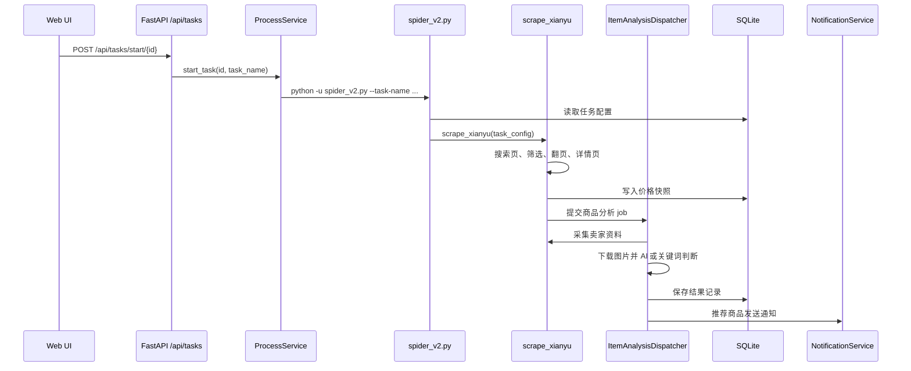

# ai-goofish-monitor 项目导览与架构说明

本文基于当前仓库代码整理，面向后续维护者、二次开发者和部署排障人员。项目本质上是一个“闲鱼商品监控平台”：用 Playwright 抓取闲鱼搜索与详情接口，用 AI 或关键词规则判断商品是否值得关注，用 Web UI 管理任务、账号、结果、日志与系统配置。

## 1. 项目定位

`ai-goofish-monitor` 不是单一脚本，而是一个包含后端服务、前端控制台、爬虫运行器、AI 分析、通知分发、SQLite 持久化和登录态导入工具的完整应用。

核心能力包括：

- 多任务监控：每个任务有独立关键词、筛选条件、价格范围、发布范围、区域、账号策略和判断模式。
- AI 判断与关键词判断：AI 模式通过 Prompt 生成和多模态分析判断商品；关键词模式直接用规则命中判断。
- Web 管理：提供仪表盘、任务管理、账号管理、结果浏览、日志查看、系统设置和 Prompt 编辑。
- 独立任务进程：后端通过子进程启动 `spider_v2.py`，任务日志写入 `logs/`。
- SQLite 主存储：任务、结果、价格快照和结果黑名单规则写入 SQLite，同时保留旧文件导入兼容。
- 通知推送：支持 ntfy、企业微信、Bark、Telegram、Gotify 和通用 Webhook。
- 账号和代理轮换：支持任务绑定账号、账号池、代理池、失败后重试与失败保护。

## 2. 技术栈

| 层级 | 技术 | 主要位置 |
| --- | --- | --- |
| 后端 API | FastAPI、Uvicorn | `src/app.py`、`src/api/routes/` |
| 爬虫 | Playwright async API | `spider_v2.py`、`src/scraper.py` |
| AI 接入 | OpenAI 兼容 API、Responses/Chat Completions 兼容逻辑 | `src/ai_handler.py`、`src/infrastructure/external/ai_client.py`、`src/services/ai_request_compat.py` |
| 调度 | APScheduler | `src/services/scheduler_service.py` |
| 存储 | SQLite、兼容旧 JSON/JSONL | `src/infrastructure/persistence/`、`src/services/result_storage_service.py` |
| 前端 | Vue 3、Vite、TypeScript、Tailwind、reka-ui、lucide | `web-ui/` |
| 测试 | pytest、coverage、Vue build check | `tests/`、`pyproject.toml` |
| 部署 | Docker Compose、启动脚本 | `docker-compose.yaml`、`Dockerfile`、`start.sh` |

## 3. 仓库结构

```text
.
├── src/
│   ├── app.py                         # FastAPI 入口，注册路由、生命周期、静态资源
│   ├── api/
│   │   ├── dependencies.py             # 全局服务依赖注入
│   │   └── routes/                     # tasks/results/settings/logs/accounts 等 API
│   ├── services/                       # 业务服务：任务、进程、调度、结果、通知、AI 兼容等
│   ├── domain/                         # 领域模型和仓储接口
│   ├── infrastructure/
│   │   ├── config/                     # Pydantic 配置和 .env 管理
│   │   ├── persistence/                # SQLite schema、迁移、任务仓储
│   │   └── external/                   # AI 客户端、通知客户端
│   ├── scraper.py                      # 单个任务的 Playwright 爬取与详情采集
│   ├── ai_handler.py                   # 图片下载、AI 分析、通知兼容入口
│   ├── config.py                       # 旧式环境变量和全局客户端兼容层
│   └── utils.py                        # 通用工具，save_to_jsonl 实际写入 SQLite
├── spider_v2.py                        # 爬虫 CLI，加载任务并并发执行 scrape_xianyu
├── web-ui/                             # Vue 3 控制台
├── chrome-extension/                   # 登录态导出扩展
├── tests/                              # 单元、集成、live smoke 测试
├── prompts/                            # Prompt 模板和任务 criteria 文件
├── static/                             # README 截图资源
├── config.json.example                 # 旧任务配置样例，当前主存储为 SQLite
├── .env.example                        # 环境变量样例
└── docker-compose.yaml                 # 推荐部署入口
```

运行时会产生或使用以下目录：

- `data/`：SQLite 主库，默认 `data/app.sqlite3`。
- `state/`：闲鱼账号登录态 JSON。
- `logs/`：任务进程日志和 AI 请求摘要日志。
- `images/`：商品图片临时下载目录，任务结束后会清理任务图片子目录。
- `jsonl/`：旧结果文件目录，启动时可导入到 SQLite。
- `price_history/`：旧价格历史目录，启动时可导入到 SQLite。

## 4. 后端架构

### 4.1 FastAPI 入口

`src/app.py` 是后端入口。应用创建时注册这些路由：

- `/api/tasks`：任务增删改查、启动、停止、AI/关键词任务生成。
- `/api/dashboard`：仪表盘聚合数据。
- `/api/results`：结果列表、分页查询、导出、黑名单、商品状态、价格洞察。
- `/api/logs`：任务日志读取、tail、清空。
- `/api/settings`：通知、AI、账号/代理轮换、系统状态。
- `/api/prompts`：Prompt 文件读取与更新。
- `/api/login-state`：根登录态兼容接口。
- `/api/accounts`：多账号登录态管理。
- `/ws`：前端实时更新事件。
- `/health`：健康检查。
- `/auth/status`：前端登录校验。

生命周期启动时会执行：

1. `bootstrap_sqlite_storage()` 初始化 SQLite schema，并从旧 `config.json/jsonl/price_history` 导入历史数据。
2. `cleanup_task_logs()` 清理过期任务日志。
3. 重置所有任务 `is_running=false`，避免服务异常退出后前端显示脏状态。
4. `scheduler_service.reload_jobs()` 根据任务 Cron 重新加载定时任务。
5. 启动 APScheduler。

生命周期关闭时会停止调度器，并调用 `process_service.stop_all()` 终止所有任务进程。

### 4.2 分层边界

代码基本遵循 `API -> services -> domain -> infrastructure` 的分层：

- API 层只处理 HTTP 输入输出、依赖注入、异常转换和少量跨服务协调。
- services 层承载业务流程，例如任务管理、调度、进程控制、结果读写、通知配置、AI 兼容。
- domain 层定义任务模型、校验规则和仓储接口。
- infrastructure 层负责 SQLite、`.env`、OpenAI 客户端、通知客户端等外部资源。

比较重要的服务：

- `TaskService`：任务的增删改查和运行状态更新。
- `ProcessService`：启动和停止爬虫子进程，写任务日志，跟踪进程生命周期。
- `SchedulerService`：把任务 Cron 转成 APScheduler job。
- `TaskGenerationService`：管理 AI 任务生成 job 的状态。
- `ItemAnalysisDispatcher`：受控并发地处理商品分析、卖家资料、图片、AI/关键词判断、保存和通知。
- `ResultStorageService`：统一从 SQLite 查询和写入结果。
- `NotificationService`：统一分发多渠道通知。

## 5. 任务执行链路

任务可以由用户手动启动，也可以由 Cron 定时触发。两者最终都会进入 `ProcessService.start_task()`。



### 5.1 `spider_v2.py`

`spider_v2.py` 是爬虫命令行入口。它支持：

- `--task-name`：只运行指定任务，通常由后端任务启动或调度器调用。
- `--debug-limit`：每个任务最多处理 N 个新商品。
- `--config`：显式读取旧 JSON 配置，否则默认从 SQLite 读取任务。

启动后，它会：

1. 检查是否存在登录态：根 `xianyu_state.json`、任务绑定账号或 `state/*.json`。
2. 规范化任务判断模式：`ai` 或 `keyword`。
3. 关键词模式不读取 Prompt。
4. AI 模式读取 base prompt 和 criteria prompt，组合成最终 `ai_prompt_text`。
5. 只运行启用的任务，指定 `--task-name` 时只运行该任务。
6. 对每个任务创建 `scrape_xianyu()` 协程并发执行。

### 5.2 `src/scraper.py`

`scrape_xianyu()` 是单个任务的核心执行器。主要职责：

- 读取任务筛选条件：关键词、页数、个人卖家、价格、包邮、新发布、区域、判断模式。
- 加载历史结果去重：通过 `load_processed_link_keys()` 避免重复处理已保存商品。
- 加载历史价格快照：用于构建价格参考。
- 根据账号策略和代理策略选择登录态与代理。
- 启动 Playwright Chromium，应用移动端上下文和反自动化脚本。
- 访问闲鱼首页，再进入搜索页，等待搜索 API 响应。
- 应用页面筛选条件并处理分页。
- 解析搜索结果，写入本轮市场价格快照。
- 对新商品打开详情页，捕获详情 API。
- 解析商品图片、想要人数、浏览量、卖家 ID、芝麻信用和注册天数。
- 构建基础记录，并提交给 `ItemAnalysisDispatcher`。
- 捕获登录失效、风控验证、超时和取消信号。
- 根据失败保护策略记录失败、暂停任务或发送异常通知。
- 任务结束后清理临时图片目录。

### 5.3 分析分发器

`src/services/item_analysis_dispatcher.py` 把耗时的分析动作从主爬取循环中拆出来，并通过 semaphore 控制并发。单个商品 job 会执行：

1. 采集或复用卖家资料。
2. 如果是关键词模式，调用 `keyword_rule_engine` 构建全文并计算命中。
3. 如果是 AI 模式，按需下载商品图片，调用 `get_ai_analysis()`。
4. 把 `ai_analysis` 写入最终记录。
5. 调用兼容旧名的 `save_to_jsonl()`，实际写入 SQLite。
6. 如果 `is_recommended=true`，发送通知。

默认 AI 并发由 `AI_ANALYSIS_CONCURRENCY` 控制，图片下载并发由 `IMAGE_DOWNLOAD_CONCURRENCY` 控制。

## 6. AI 分析

AI 分析当前主要在 `src/ai_handler.py`，另有 `src/infrastructure/external/ai_client.py` 作为较新的客户端封装。

`get_ai_analysis()` 的行为：

- 把完整商品记录序列化成 JSON。
- 读取任务合成后的 Prompt 作为系统/分析要求。
- 可将本地图片编码为 `data:image/jpeg;base64,...` 多模态内容。
- 优先走 Chat Completions 风格接口。
- 如果兼容服务不支持 Chat Completions，会回退 Responses API。
- 如果模型或网关不支持结构化 JSON 输出，会自动关闭 `response_format` 重试。
- 如果网关不支持 `temperature`，会移除该参数重试。
- 最多重试 4 次，并校验返回 JSON 是否包含关键字段。

AI 返回结构至少应包含：

- `prompt_version`
- `is_recommended`
- `reason`
- `risk_tags`
- `criteria_analysis`
- `criteria_analysis.seller_type`

如果 `SKIP_AI_ANALYSIS=true`，分发器会跳过 AI，直接生成推荐结果并通知，适合调试通知和爬虫链路。

## 7. 数据存储

当前主存储是 SQLite，默认路径为 `data/app.sqlite3`，可用 `APP_DATABASE_FILE` 覆盖。schema 在 `src/infrastructure/persistence/sqlite_connection.py`。

核心表：

| 表 | 用途 |
| --- | --- |
| `tasks` | 任务配置和运行状态 |
| `result_items` | 商品结果、推荐状态、原始 JSON、隐藏状态 |
| `price_snapshots` | 每次搜索看到的市场价格快照 |
| `result_blacklist_rules` | 每个结果集的隐藏关键词规则 |
| `app_metadata` | 迁移和 bootstrap 标记 |

兼容策略：

- `config.json`：如果 `tasks` 为空且未完成导入，会导入旧任务配置。
- `jsonl/*.jsonl`：如果 `result_items` 为空且未完成导入，会导入旧结果。
- `price_history/*_history.jsonl`：如果 `price_snapshots` 为空且未完成导入，会导入旧价格快照。
- 旧函数名 `save_to_jsonl()` 仍保留，但实际调用 `save_result_record()` 写 SQLite。
- 结果文件名仍采用 `xxx_full_data.jsonl` 命名，以兼容前端和导出语义。

## 8. 主要 API 面

### 8.1 任务

- `GET /api/tasks`：任务列表，包含下一次运行时间。
- `GET /api/tasks/{task_id}`：单任务详情。
- `POST /api/tasks/`：直接创建任务。
- `POST /api/tasks/generate`：创建任务。AI 模式返回后台 job，关键词模式直接创建。
- `GET /api/tasks/generate-jobs/{job_id}`：查询 AI 任务生成进度。
- `PATCH /api/tasks/{task_id}`：更新任务，必要时重新生成 criteria 文件。
- `DELETE /api/tasks/{task_id}`：删除任务，并清理无其他任务引用的结果和价格快照。
- `POST /api/tasks/start/{task_id}`：启动任务子进程。
- `POST /api/tasks/stop/{task_id}`：停止任务子进程。

### 8.2 结果

- `GET /api/results/files`：列出结果集。
- `GET /api/results/files/{filename}`：以 NDJSON 下载结果。
- `DELETE /api/results/files/{filename}`：删除结果集。
- `GET /api/results/{filename}`：分页查询结果，支持推荐筛选、隐藏项、排序。
- `GET /api/results/{filename}/insights`：价格洞察。
- `GET /api/results/{filename}/export`：导出 CSV。
- `PATCH /api/results/{filename}/items/{item_id}/status`：标记商品 active/hidden/expired。
- `GET/PUT /api/results/{filename}/blacklist-rules`：读取或保存结果隐藏规则。

### 8.3 设置和运维

- `GET/PUT /api/settings/notifications`：通知配置。
- `POST /api/settings/notifications/test`：通知测试。
- `GET/PUT /api/settings/rotation`：账号和代理轮换配置。
- `GET /api/settings/status`：系统状态。
- `GET/PUT /api/settings/ai`：AI 配置。
- `POST /api/settings/ai/test`：AI 连接测试。
- `GET/PUT /api/prompts/{filename}`：Prompt 文件编辑。
- `GET/DELETE /api/logs`、`GET /api/logs/tail`：日志查看和清理。
- `GET/POST/PUT/DELETE /api/accounts`：多账号登录态管理。
- `POST/DELETE /api/login-state`：根登录态兼容管理。

### 8.4 WebSocket

前端连接 `/ws`，后端广播的典型事件包括：

- `task_status_changed`
- `tasks_updated`
- `results_updated`

前端 composables 会监听这些事件并刷新任务、结果或状态。

## 9. 前端架构

前端位于 `web-ui/`，技术栈为 Vue 3 + Vite + TypeScript。

主要目录：

```text
web-ui/src/
├── api/                 # API 调用封装
├── composables/         # useTasks/useResults/useSettings/useLogs 等状态逻辑
├── components/          # 业务组件和 UI 基础组件
├── layouts/             # 主布局
├── router/              # Vue Router
├── views/               # 页面级组件
├── i18n/                # 中英文文案
├── services/            # WebSocket service
└── types/               # Task/Result/Dashboard 类型
```

路由结构：

- `/login`：登录页。
- `/dashboard`：监控概览。
- `/tasks`：任务管理、创建、编辑、启动、停止、刷新 criteria。
- `/accounts`：登录态账号管理。
- `/results`：结果浏览、筛选、导出、隐藏、黑名单、价格趋势。
- `/logs`：任务日志。
- `/settings`：AI、通知、轮换、状态、Prompt 设置。

前端鉴权当前是轻量模式：

- 登录页通过 `POST /auth/status` 校验用户名和密码。
- 成功后把登录状态写入 localStorage。
- 路由守卫根据 localStorage 判断是否允许进入后台页面。
- WebSocket 也根据 localStorage 决定是否自动连接。

这意味着生产部署应在外层网络、反向代理或访问控制上额外加固，不能只依赖前端路由守卫。

构建产物：

- `web-ui/vite.config.ts` 设置 `outDir` 为仓库根目录 `dist/`。
- 后端会提供 `dist/index.html` 和 `dist/assets/`。
- Vite 开发服务器代理 `/api`、`/auth`、`/ws` 到 `127.0.0.1:8000`。

## 10. 配置说明

最少需要配置 `.env`：

```env
OPENAI_API_KEY=sk-...
OPENAI_BASE_URL=https://api.openai.com/v1/
OPENAI_MODEL_NAME=your-vision-model
WEB_USERNAME=admin
WEB_PASSWORD=admin123
SERVER_PORT=8000
RUN_HEADLESS=true
```

关键配置组：

- AI：`OPENAI_API_KEY`、`OPENAI_BASE_URL`、`OPENAI_MODEL_NAME`、`PROXY_URL`、`ENABLE_RESPONSE_FORMAT`、`ENABLE_THINKING`、`SKIP_AI_ANALYSIS`。
- Web：`SERVER_PORT`、`WEB_USERNAME`、`WEB_PASSWORD`。
- 爬虫：`RUN_HEADLESS`、`LOGIN_IS_EDGE`、`PCURL_TO_MOBILE`。
- 通知：`NTFY_TOPIC_URL`、`BARK_URL`、`WX_BOT_URL`、`TELEGRAM_*`、`GOTIFY_*`、`WEBHOOK_*`。
- 失败保护：`TASK_FAILURE_THRESHOLD`、`TASK_FAILURE_PAUSE_SECONDS`、`TASK_FAILURE_GUARD_PATH`。
- 日志：`TASK_LOG_RETENTION_DAYS`。
- 账号轮换：`ACCOUNT_ROTATION_ENABLED`、`ACCOUNT_ROTATION_MODE`、`ACCOUNT_STATE_DIR`、`ACCOUNT_ROTATION_RETRY_LIMIT`、`ACCOUNT_BLACKLIST_TTL`。
- 代理轮换：`PROXY_ROTATION_ENABLED`、`PROXY_ROTATION_MODE`、`PROXY_POOL`、`PROXY_ROTATION_RETRY_LIMIT`、`PROXY_BLACKLIST_TTL`。
- 数据库：`APP_DATABASE_FILE`。

## 11. 本地开发

### 11.1 后端

```bash
python -m src.app
```

或：

```bash
uvicorn src.app:app --host 0.0.0.0 --port 8000 --reload
```

### 11.2 前端

```bash
cd web-ui
npm install
npm run dev
```

构建：

```bash
cd web-ui
npm run build
```

### 11.3 爬虫调试

```bash
python spider_v2.py --task-name "MacBook Air M1" --debug-limit 3
```

如果想显式走旧 JSON 配置：

```bash
python spider_v2.py --config config.json --debug-limit 3
```

### 11.4 一键启动

```bash
bash start.sh
```

`start.sh` 会检查 Playwright 和浏览器，安装依赖，构建前端，并启动后端。

## 12. Docker 部署

推荐入口：

```bash
cp .env.example .env
docker compose up -d
docker compose logs -f app
```

`docker-compose.yaml` 默认：

- 使用 `ghcr.io/usagi-org/ai-goofish:latest`。
- 映射 `8000:8000`。
- 设置 `APP_DATABASE_FILE=/app/data/app.sqlite3`。
- 挂载 `.env`、`data/`、`state/`、`config.json`、`prompts/`、`jsonl/`、`logs/`、`images/`、`price_history/`。

生产部署建议：

- 修改默认 `WEB_USERNAME/WEB_PASSWORD`。
- 限制公网访问来源。
- 使用 HTTPS。
- 保护 `.env`、`state/` 和 `data/app.sqlite3`。
- 谨慎开启过高频率的任务 Cron 和过大页数。

## 13. 测试体系

pytest 配置在 `pyproject.toml`：

```bash
pytest
pytest --cov=src
coverage run -m pytest
```

测试分布：

- `tests/unit/`：纯函数、领域模型、AI 兼容、通知、价格历史、调度分页、失败保护等。
- `tests/integration/`：API、CLI、结果查询、设置接口、解析链路等。
- `tests/live/`：真实流量冒烟测试，默认关闭，需要 `RUN_LIVE_TESTS=1` 和真实账号。
- `tests/fixtures/`：搜索结果、评价、用户信息、配置、登录态样例。

前端构建路径有专门测试 `tests/test_frontend_build_paths.py`，用于保证 Vite 输出目录和后端托管路径一致。

## 14. 常见排障路径

### 前端打开报“构建产物不存在”

说明根目录 `dist/` 不存在。运行：

```bash
cd web-ui
npm run build
```

### 任务无法启动

优先检查：

- `.env` 是否存在。
- `state/` 下是否有账号 JSON，或任务是否绑定了 `account_state_file`。
- 任务是否 `enabled=true`。
- `logs/<task_name>_<id>.log` 中是否有登录失效、风控或 Playwright 错误。
- `TASK_FAILURE_GUARD_PATH` 对应状态是否把任务暂停了。

### AI 分析一直失败

优先检查：

- `OPENAI_BASE_URL` 和 `OPENAI_MODEL_NAME`。
- 模型是否支持图片输入。
- 网关是否支持 `response_format`，必要时设 `ENABLE_RESPONSE_FORMAT=false`。
- 网关是否支持 `temperature`，代码会自动移除后重试。
- 是否需要 `PROXY_URL`。
- 打开 `AI_DEBUG_MODE=true` 查看请求摘要。

### 结果页没有新商品

可能原因：

- 结果已通过 `link_unique_key` 去重。
- 闲鱼筛选条件过窄，例如区域、价格、新发布、包邮组合。
- 商品被结果黑名单或状态隐藏。
- 任务还在分析分发器队列中，需等待后台分析完成。
- 任务日志中有风控、登录失效或翻页失败。

### Docker 中 Edge 设置无效

Docker 镜像未内置 Edge。即使 `LOGIN_IS_EDGE=true`，容器内也会改用 Chromium。

## 15. 二次开发建议

新增后端能力时建议按以下路径放置：

- 新 HTTP 接口：`src/api/routes/`，并在 `src/app.py` 注册。
- 新业务流程：`src/services/`。
- 新领域约束：`src/domain/models/`。
- 新持久化：优先扩展 `src/infrastructure/persistence/`，并把 schema 或迁移写入 SQLite 初始化逻辑。
- 新前端页面：`web-ui/src/views/`、`web-ui/src/router/index.ts`。
- 新前端业务组件：`web-ui/src/components/<domain>/`。
- 新前端 API：`web-ui/src/api/`。
- 新测试：先补 `tests/unit/`，跨模块行为补 `tests/integration/`。

需要注意的兼容命名：

- `save_to_jsonl()` 虽然名字里有 JSONL，但现在写 SQLite。
- 结果集文件名仍为 `*_full_data.jsonl`，这是兼容历史 UI 和下载语义。
- `config.json` 仍可用于旧配置导入，但主数据源已经是 SQLite。

## 16. 安全与合规

- 不要提交真实 `.env`、账号 cookies、`state/*.json`、数据库和运行日志。
- Web 默认账号密码是 `admin/admin123`，生产必须修改。
- 登录态文件可以直接代表账号访问能力，应按敏感凭据处理。
- 本项目涉及第三方平台页面和接口访问，使用时应遵守平台协议、robots 规则和当地法律法规。
- 建议降低任务频率、限制页数、使用失败保护，避免频繁请求导致账号风控。

## 17. 快速维护清单

修改任务模型时：

1. 更新 `src/domain/models/task.py`。
2. 更新 SQLite schema 和导入逻辑。
3. 更新 `sqlite_task_repository.py` 的读写映射。
4. 更新前端 `web-ui/src/types/task.d.ts` 和任务表单。
5. 补 API 集成测试和领域模型单元测试。

修改结果结构时：

1. 更新 `ItemAnalysisDispatcher` 或 `scraper.py` 的记录构造。
2. 更新 `result_storage_service.py` 的索引字段提取。
3. 更新结果页类型和卡片组件。
4. 补结果查询、导出和价格洞察测试。

修改 AI 调用时：

1. 优先复用 `ai_request_compat.py`。
2. 保留 Chat Completions 和 Responses API 的回退能力。
3. 保留结构化输出和 temperature 的自动降级。
4. 补 `tests/unit/test_ai_handler_analysis.py` 或 `tests/unit/test_ai_client.py`。

修改前端构建路径时：

1. 同步 `web-ui/vite.config.ts` 的 `outDir`。
2. 同步 `src/app.py` 的静态资源挂载。
3. 更新 `tests/test_frontend_build_paths.py`。
